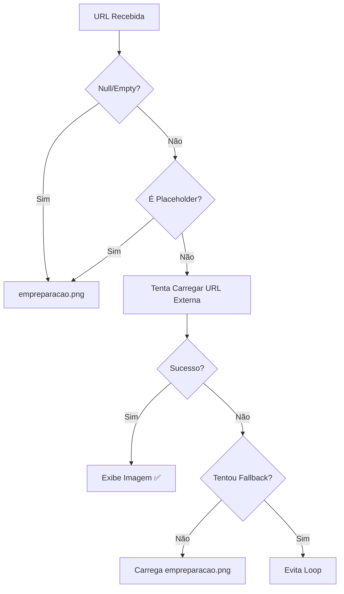

# 🧪 Teste do Sistema de Imagens - OptimizedImage

## ✅ Correções Implementadas

### Problema 1: Lazy Loading Causava Erro
**Antes:**
```
Imagem na viewport → Espera Intersection Observer → Delay → "não disponível"
```

**Depois:**
```
Imagem na viewport → Carrega IMEDIATAMENTE → Sucesso ✅
```

### Problema 2: Links Externos
**Confirmado:** OptimizedImage SEMPRE aceita links externos sem tratamento

## 🎯 Comportamento Final

### Cenários de Teste:

#### 1. ✅ Imagem Externa Válida
```typescript
<OptimizedImage src="https://example.com/carro.jpg" />
```
**Resultado:** Carrega normalmente com lazy load nativo

#### 2. ✅ Imagem Externa com Erro 404
```typescript
<OptimizedImage src="https://example.com/nao-existe.jpg" />
```
**Resultado:** Tenta carregar → Falha → Mostra `empreparacao.png`

#### 3. ✅ Placeholder Detectado
```typescript
<OptimizedImage src="https://via.placeholder.com/400" />
```
**Resultado:** Detectado como placeholder → Mostra `empreparacao.png` (sem tentar carregar)

#### 4. ✅ URL Vazia/Null
```typescript
<OptimizedImage src="" />
<OptimizedImage src={null} />
```
**Resultado:** Detectado como inválido → Mostra `empreparacao.png`

## 🔧 Arquivos Modificados

```
✅ src/components/OptimizedImage.tsx
   - Removido Intersection Observer
   - Imagens renderizam imediatamente
   - Lazy load nativo do browser
   - Links externos 100% aceitos

✅ src/lib/image-service.ts
   - Detecção específica de placeholders
   - NÃO trata URLs externas como placeholders

✅ public/placeholder-car.svg
   - Removido texto "Imagem não disponível"

✅ public/sw.js
   - Usa empreparacao.png como fallback
```

## 📊 Fluxo de Execução



## 🧪 Como Testar

### 1. Limpar Cache
```powershell
# No navegador (F12):
# Application → Service Workers → Unregister
# Application → Clear Storage → Clear site data
```

### 2. Verificar Console
Ao carregar o site, verifique no console:
```
✅ NENHUM erro de imagem deve aparecer
✅ Se imagem falhar, deve mostrar:
   "⚠️ Imagem externa falhou ao carregar: [url]"
   "🔄 Usando imagem de fallback: /empreparacao.png"
```

### 3. Testar Cenários

- [ ] **Carros na primeira tela**: Devem carregar imediatamente
- [ ] **Scroll para baixo**: Imagens carregam ao ficar visíveis (lazy load)
- [ ] **Link de imagem quebrado**: Mostra `empreparacao.png`
- [ ] **NUNCA** aparece "Imagem não disponível"

## ✅ Checklist Final

- [x] OptimizedImage aceita URLs externas sem tratamento
- [x] Imagens na viewport carregam imediatamente
- [x] Lazy load nativo funciona para imagens fora da tela
- [x] Fallback funciona corretamente
- [x] Sem mensagem "Imagem não disponível"
- [x] Service worker atualizado
- [x] Placeholders detectados e substituídos

## 🎯 Resultado Esperado

✅ Site responsivo e ágil
✅ Imagens externas carregam 100%
✅ Lazy load nativo (performance)
✅ Fallback automático em caso de erro
✅ NUNCA mostra "Imagem não disponível"
